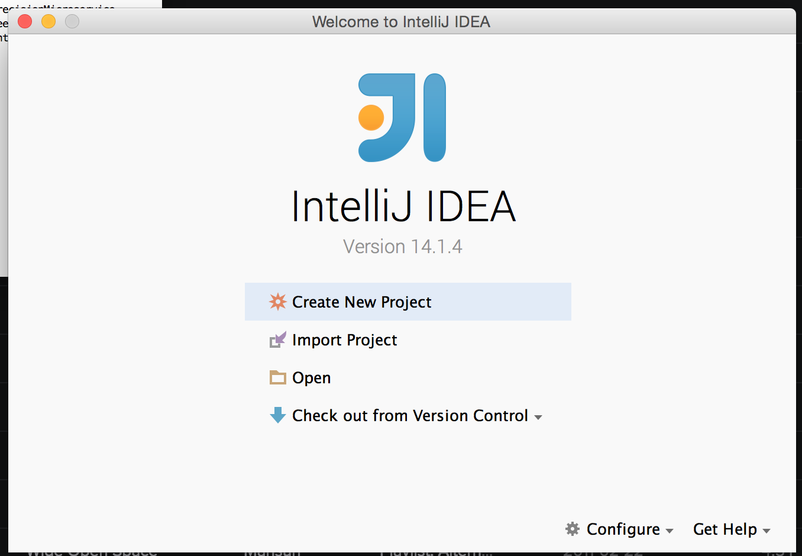
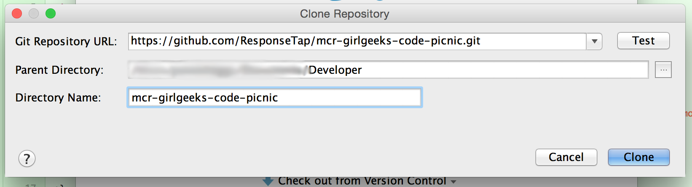
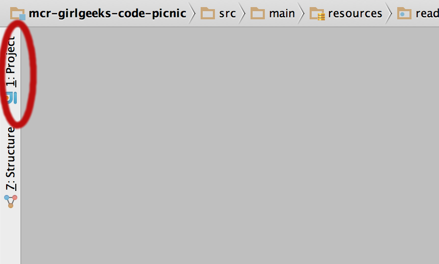
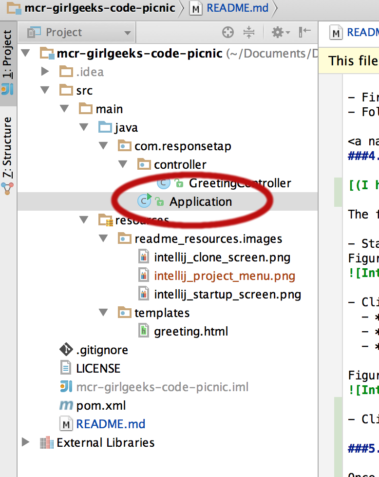

# National Coding Week

## Tutorial

This README provides instructions for the Java coding track as part of National Coding Week. It will provide step by step instructions for getting your laptop set up and ready to go.

If you are having any problems with the instructions below please come along to the coding picnic slightly earlier and 
we can help you get your laptops ready.

###1. Install Git

[(I already have Git installed, skip me to step 2)](#step2Java)

The sample starter code for the event is stored on [GitHub](https://github.com/eggsy84/java-webapp-coding-week)
. In order to get a copy of the sample code we need to firstly install [Git version control](https://git-scm.com).

Follow the instructions on the following pages:

Mac [https://git-scm.com/book/en/v2/Getting-Started-Installing-Git#Installing-on-Mac](https://git-scm.com/book/en/v2/Getting-Started-Installing-Git#Installing-on-Mac)  
Windows [https://git-scm.com/book/en/v2/Getting-Started-Installing-Git#Installing-on-Windows](https://git-scm.com/book/en/v2/Getting-Started-Installing-Git#Installing-on-Windows)  
Linux [https://git-scm.com/book/en/v2/Getting-Started-Installing-Git#Installing-on-Linux](https://git-scm.com/book/en/v2/Getting-Started-Installing-Git#Installing-on-Linux)  

###2. Install Java

[(I already have Java installed, skip me to step 3)](#step3Ide)

Next step is to install the Java Development Kit (JDK).

**Windows**

- Navigate to [http://www.oracle.com/technetwork/java/javase/downloads/jdk8-downloads-2133151.html](http://www.oracle.com/technetwork/java/javase/downloads/jdk8-downloads-2133151.html)  
- Click 'Accept Licence Agreement' under the 'Java SE Development Kit 8u51' section.  
- Click 'jdk-8u51-windows-x64.exe' to download the 64bit Java version.
- Once the file has downloaded, double click the exe file to begin the installation and follow the instructions on screen

Further details on Windows installation can be found on the [Java website](https://docs.oracle.com/javase/8/docs/technotes/guides/install/windows_jdk_install.html).

**MAC OS**

- Navigate to [http://www.oracle.com/technetwork/java/javase/downloads/jdk8-downloads-2133151.html](http://www.oracle.com/technetwork/java/javase/downloads/jdk8-downloads-2133151.html)  
- Click 'Accept Licence Agreement' under the 'Java SE Development Kit 8u51' section.  
- Click 'jdk-8u51-macosx-x64.dmg' to download Java for Mac.
- Once the file has downloaded, double click the dmg file to begin the installation and follow the instructions on screen.

###3. Install IntelliJ

[(I already have installed IntelliJ, skip me to step 4)](#step4Clone)

To make things a little easier we'll make use of an Integrated Development Environment (IDE) called IntelliJ.

- First navigate to the [JetBrains website](https://www.jetbrains.com/idea/download/) and download the community edition of IntelliJ  
- Follow the [installation and set up instructions](https://www.jetbrains.com/idea/documentation/)  

###4. Clone the tutorial code base

[(I have already cloned the code, skip me to step 5)](#step5Start)

The final preparation step is to clone the source code from [GitHub](https://github.com/eggsy84/java-webapp-coding-week).

- Start IntelliJ and you should see a screen similar to figure 1 below.
Figure 1

- Click 'Check out from Version Control' and you should be presented with a screen similar to figure 2.  
  - **Git Repository URL** https://github.com/eggsy84/java-webapp-coding-week.git
  - **Parent Directory** Choose a directory on your machine
  - **Directory Name** java-webapp-coding-week
  
Figure 2
  

- Click Clone

###5. Start your web application

[(I have already started the web application, skip me to step 6)](#step6Browser)

Once the code has been cloned to your machine, we can do the fun part and start up the application.

- Click the *1 : Project* link shown in the top right of the IntelliJ screen

Figure 3  
  

- Navigate to the Java file called *Application*

Figure 4  

- Right click the file
- Click *Run Application.main()*
- You should start to see output of the application starting up.

###6. View your web application

Open up your favourite web browser at go to:

[http://localhost:8080/greeting?name=java](http://localhost:8080/greeting?name=java)

Try replacing 'java' with your name ;)

## Useful web sites

[Git version control](https://git-scm.com)

[GitHub Project](https://github.com/eggsy84/java-webapp-coding-week)

[CodeUp Manchester](http://codeupmcr.co.uk)

[ResponseTap](http://responsetap.com)

[Spring form submission guide](http://spring.io/guides/gs/handling-form-submission/)

[Spring validation guide](http://spring.io/guides/gs/validating-form-input/)

